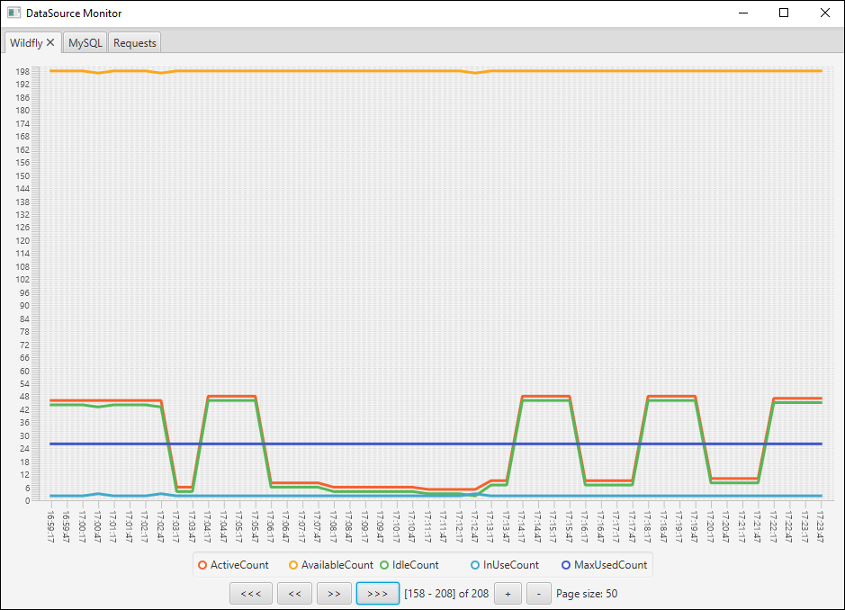

Universal Monitoring Tool
=========================

[The same in Russian](README_RU.md)

A utility for monitoring network resources such as databases, servlet containers, and various URLs.

* Flexible configuration of resources and metrics in the YAML file.
* Support for BASIC and DIGEST Authentication.
* Java FX based UI for viewing statistics in line charts.
* Console version



A bit of history
---------------

This utility was written when we had problems with the project in the `Java EE` container.
The error `IJ000453: Unable to get managed connection for java:/d ...`

The first thought is that there are not enough connections. It made sense to monitor a database,
and the pool of connections in the container, while simultaneously accessing the project’s endpoint.

Since the DevOps was far away, the server was too, and we write in Windows, that is, to install something serious, 
but free there was no possibility for monitoring, it was decided to write this utility.

I really hope that it is useful to someone else.

Installation and setup
---------------------

### Console version

Performs tasks and saves execution results without displaying on the screen. In the future, the files with the results can be viewed in the window version.

* Unzip archive `console-monitor-%.%.zip` in the `./console-monitor/target` directory.
* **Configure** `config.yml`
* Run `console-monitor.bat`, or manually: `java -jar console-monitor.jar`.

### UI version

* Unzip archive `javafx-monitor-%.%.zip` in the `./javafx-monitor/target` directory.
* **Configure** `config.yml`
* Run `javafx-monitor.bat`, or manually: `java -jar javafx-monitor.jar`.

### Settings File

All settings are collected in the `config.yml` file. `YAML` allows us to conveniently store any data in a very attractive way.

#### General settings

* `requestIntervalInSeconds`: requests interval in seconds. Default `30`.
* `saveStateIntervalInSeconds`: interval of saving settings and metrics in seconds. Default `600` (10 minutes).

#### Interface Settings

*These settings are relevant only for the window version.*

* `window.width` and` window.height`: the width and height of the window, respectively.
* `window.maximized`: state of the window: maximized or not. The default is `false`.

#### Charts Settings

`charts`: setting up one or more line graphs.

*These settings are relevant only for the window version.*

* `horizontalScale` and `pageSize` control the horizontal density of data display.
These values are global for all line charts.
Default values: `1` and `200`, respectively. Metrics display count: `horizontalScale * pageSize`. 
At runtime `pageSize` value doesn't change runtime. Only `horizontalScale`.

* `items`: individual line chart settings. There may be several charts.
   * `id`: chart identifier. Separate metrics will be attached to it. Example: `0`, `1`, `2`, ... String values are allowed.
   * `name`: the name of the panel on which the chart will be displayed.
   * `lowerBound`: the lower bound of the chart values. Default: `0`.
   * `upperBound`: the upper bound of the chart values. Default: `200`.
   * `tickUnit`: the frequency of the horizontal grid in the chart. Default: `1`.

Example:

```yaml
gui:
  window:
    width: 900
    height: 650

  charts:
    horizontalScale: 1.0
    pageSize: 200

    items:
      - id: '0'
        name: Wildfly
        lowerBound: 0
        upperBound: 200
        tickUnit: 1
      - id: '1'
        name: MySQL
        lowerBound: 0
        upperBound: 210
        tickUnit: 1
      - id: '2'
        name: Requests
        lowerBound: 0
        upperBound: 500
        tickUnit: 10
```

#### Setup tasks

The metrics obtained after each request can be very flexibly displayed in the desired chart, grouping them as you like.

First you need to decide on the task - what exactly will we monitor.

Let's say we will monitor the `DataSource WildFly`, the database` MySQL` and execute one query,
to make sure the project is still alive.

##### WildFly

```yaml
tasks:
  # WildFly, DataSource
  - name: DataSource
    request: HTTP
    timeOffsetInSeconds = 0
    url: 'http://localhost:9990/management/subsystem/datasources/data-source/testDS/statistics/pool?read-resource&include-runtime=true&recursive&json.pretty'
    authentication:
      type: DIGEST
      userName: 'userName'
      password: 'password'
      params:
        host: localhost
        port: 9990
        realm: ManagementRealm
    responseFormat: JSON
    metrics:
      - name: ActiveCount
        chartId: 0
        logAnyChange: false
      - name: BlockingFailureCount
        logAnyChange: true
```

This task gets metrics from `WildFly`. There are a lot of them, at the bottom there are several links to sources.
 
The values of the `ActiveCount` metric will be visible on the` chart-0`, but the values of the `BlockingFailureCount` metric will not.
But with any change in the console, a message will be displayed. This is very convenient when there is some little changeable data,
and there is no desire to clutter up the charts.

* `name`: task name. It is displayed in the console logs and also serves as the file name for saving metrics.
* `request`: `HTTP`. Everything is clear here. Another possible meaning: `JDBC`.
* `timeOffsetInSeconds`. The offset of the request execution time relative to the total execution time. 
It makes sense to execute some queries later than others. The default is `0`.
* `authentication.type`: authentication type. `NONE`, `BASIC`, `DIGEST`, `PASSWORD`. `BASIC` is generally the same as `PASSWORD`,
but the `Authentication` header (http client bug) is forcibly set.
* `responseFormat`: `JSON`. It is set when we know that the server returns metrics in the `Json` format.
Then they are transformed into `Map` and filtered.
Other possible values: `CUSTOM` (unknown format, this is for the database), `STATUS_CODE_ONLY` - the response body is ignored,
only the result code is returned (for example, `200`, `401`, or `500`).

Since `WildFly` just doesn’t give out metrics, you need to authenticate as a `Management User`.
Specifically need `Digest Authentication`.

##### MySQL

Everything is simple here, we just need to add that the metrics are obtained by the following query: `SHOW GLOBAL STATUS LIKE '%%'`.

```yaml
  # MySQL address
  - name: MySql
    request: JDBC
    timeOffsetInSeconds = 0
    url: 'jdbc:mysql://localhost:3306/mydb?useUnicode=true&useJDBCCompliantTimezoneShift=true&useLegacyDatetimeCode=false&serverTimezone=UTC'
    authentication:
      type: PASSWORD
      userName: 'userName'
      password: 'password'
    responseFormat: CUSTOM
    metrics:
      - name: Aborted_clients
        chartId: 1
        logAnyChange: false
      - name: Max_execution_time_set_failed
        logAnyChange: true
```

Naturally, the database address, as well as the username and password will be different.

##### Custom request

In this example, we will simply verify that the endpoint does not crash and work out as needed (code `200`).
Endpoint is protected with `Basic Authentication`, but this is not a problem.

The server line of life will be displayed on `chart-2`.

In case of any crash, messages will also be displayed in the console.

Note the name of the metric `Request_StatusCode`. This is the `task name` + `"_StatusCode"`.
If called incorrectly, there will be errors. These difficulties are associated with the features of the `Map` collection.

```yaml
  # Business request
  - name: Request
    request: HTTP
    timeOffsetInSeconds = 0
    url: 'http://translate.google.com/?hl=ru#view=home&op=translate&sl=en&tl=ru&text=This%20is%20an%20example'
    authentication:
      type: BASIC
      userName: 'userName'
      password: 'password'
    responseFormat: STATUS_CODE_ONLY
    metrics:
      - name: Request_StatusCode
        chartId: 2
        logAnyChange: true
        increment: -2
        multiplier: 1
```

Let's look at the properties of the `metric` object.

* `name`: one of the names of the metrics. Must strictly match the existing metric returned by the server or database.
* `chartId`: ID of the chart on which this metric will be displayed.
* `logAnyChange`: if `true`, then any change to this metric will be reflected in the logs. Default: `false`.
* `increment`: add (or subtract) an arbitrary value from the metric.
It is very convenient, for example, if we collect HTTP statuses from several sites, and the data on the chart closes each other.
Default: `0`.
* `multiplier`: multiply the metric value by a specific real number. Default: `0.0`.

Logging Settings
----------------

The logging library `SLF4J` allows you to flexibly configure yourself. The project uses `SimpleLogger`.

Setup is done by passing the necessary parameters at startup from the command line. Example:

`java -Dorg.slf4j.simpleLogger.defaultLogLevel=trace -Dorg.slf4j.simpleLogger.logFile=your-file-path -jar console-monitor.jar`

### SimpleLogger settings list:

Simple implementation of Logger that sends all enabled log messages, for all defined loggers, to System.err.

Default logging detail level for all instances of SimpleLogger.
Must be one of ("trace", "debug", "info", "warn", or "error").
If not specified, defaults to "info".

`org.slf4j.simpleLogger.defaultLogLevel=info`

Logging detail level for a SimpleLogger instance named "a.b.c".
Right-side value must be one of "trace", "debug", "info", "warn", "error" or "off".
When a SimpleLogger named "a.b.c" is initialized, its level is assigned from this property.
If unspecified, the level of nearest parent logger will be used, and if none is set,
then the value specified by org.slf4j.simpleLogger.defaultLogLevel will be used.

```
org.slf4j.simpleLogger.log.org.apache.http.wire=warn
org.slf4j.simpleLogger.log.org.apache.http=warn
org.slf4j.simpleLogger.log.org.apache.http.impl.conn=warn
org.slf4j.simpleLogger.log.org.apache.http.impl.client=warn
org.slf4j.simpleLogger.log.org.apache.http.client=warn
```

Set to true if you want the current date and time to be included in output messages.
Default is false.

`org.slf4j.simpleLogger.showDateTime=true`

The date and time format to be used in the output messages.
The pattern describing the date and time format is the same that is used in java.text.SimpleDateFormat.
If the format is not specified or is invalid, the number of milliseconds since start up will be output.

`org.slf4j.simpleLogger.dateTimeFormat=yyyy-MM-dd HH:mm:ss`

Set to true if you want to output the current thread name.
Defaults to true.

`org.slf4j.simpleLogger.showThreadName=false`

Set to true if you want the Logger instance name to be included in output messages. Example: `md.leonis.Monitor`.
Defaults to true.

`org.slf4j.simpleLogger.showLogName=false`

Set to true if you want the last component of the name to be included in output messages. Example: `Monitor`.
Defaults to false.

`org.slf4j.simpleLogger.showShortLogName=false`

Should the level string be output in brackets?
Defaults to false.

`org.slf4j.simpleLogger.levelInBrackets=true`

The string value output for the warn level. Defaults to WARN.

`# org.slf4j.simpleLogger.warnLevelString=ACHTUNG`

The output target which can be the path to a file, or the special values "System.out" and "System.err".
Default is "System.err".

`# org.slf4j.simpleLogger.logFile=your-file-path`

If the output target is set to "System.out" or "System.err" (see preceding entry), by default,
logs will be output to the latest value referenced by System.out/err variables.
By setting this parameter to true, the output stream will be cached, i.e. assigned once at
initialization time and re-used independently of the current value referenced by System.out/err.

`# org.slf4j.simpleLogger.cacheOutputStream=true`


Using
-----

The utility periodically saves metrics at a specified time interval. Also, saving occurs on exit.

The UI is intuitive and allows you to flexibly scale data by grouping them on several panels.
Dynamically, you can change the page size and also select the required data range.

The values of `upperBound` and` tickUnit` can also be changed dynamically.

Debugging
---------

If you plan to modify the utility, then for convenience in the IDE, the file `config.yml` can be copied to the root of the project.

The appearance of the charts, for example, the color and thickness of the lines, the background color, and so on, 
can be configured in the file `modena.css`.
Then you need to attach it: `pane.getStylesheets().add("modena.css");`. 
[Read about JavaFX styles](https://docs.oracle.com/javase/8/javafx/api/javafx/scene/doc-files/cssref.html).

Used technologies
-----------------------

* Java 8
* JavaFX 8
* YAML 1.1 (SnakeYAML)
* JSON (Jackson)
* MySQL через JDBC
* Apache HttpClient, Apache Commons
* Maven
* IntelliJ Idea

Wishlist
--------

* Path to dumps (test remote too)
* Autorun. Manual Play/Stop

Where to read about metrics
---------------------------

### WildFly / JBoss

* http://middlewaremagic.com/jboss/?p=2476
* https://access.redhat.com/documentation/en-us/jboss_enterprise_application_platform/6.3/html/administration_and_configuration_guide/view_datasource_statistics
* https://docs.jboss.org/author/display/AS71/CLI+Recipes
* https://docs.wildfly.org/17/Admin_Guide.html

DataSource Metrics Example:

```json
{
"ActiveCount" : 6,
"AvailableCount" : 200,
"AverageBlockingTime" : 1,
"AverageCreationTime" : 4,
"AverageGetTime" : 3,
"AveragePoolTime" : 19440,
"AverageUsageTime" : 41,
"BlockingFailureCount" : 0,
"CreatedCount" : 7593,
"DestroyedCount" : 7587,
"IdleCount" : 6,
"InUseCount" : 0,
"MaxCreationTime" : 2016,
"MaxGetTime" : 2016,
"MaxPoolTime" : 4784742,
"MaxUsageTime" : 326639,
"MaxUsedCount" : 17,
"MaxWaitCount" : 0,
"MaxWaitTime" : 1,
"TimedOut" : 7587,
"TotalBlockingTime" : 340,
"TotalCreationTime" : 31219,
"TotalGetTime" : 8267,
"TotalPoolTime" : 2497681396,
"TotalUsageTime" : 35375564,
"WaitCount" : 0,
"XACommitAverageTime" : 0,
"XACommitCount" : 805251,
"XACommitMaxTime" : 297,
"XACommitTotalTime" : 695736,
"XAEndAverageTime" : 0,
"XAEndCount" : 0,
"XAEndMaxTime" : 0,
"XAEndTotalTime" : 0,
"XAForgetAverageTime" : 0,
"XAForgetCount" : 0,
"XAForgetMaxTime" : 0,
"XAForgetTotalTime" : 0,
"XAPrepareAverageTime" : 0,
"XAPrepareCount" : 0,
"XAPrepareMaxTime" : 0,
"XAPrepareTotalTime" : 0,
"XARecoverAverageTime" : 0,
"XARecoverCount" : 0,
"XARecoverMaxTime" : 0,
"XARecoverTotalTime" : 0,
"XARollbackAverageTime" : 0,
"XARollbackCount" : 2,
"XARollbackMaxTime" : 0,
"XARollbackTotalTime" : 0,
"XAStartAverageTime" : 0,
"XAStartCount" : 805253,
"XAStartMaxTime" : 9,
"XAStartTotalTime" : 9654,
"statistics-enabled" : true
}
```

### MySQL

* https://www.datadoghq.com/blog/collecting-mysql-statistics-and-metrics/
* https://dzone.com/articles/top-performance-metrics-to-monitor-in-your-mysql-d-1
* https://dzone.com/articles/top-performance-metrics-to-monitor-on-mysql-connec

MySQL Metrics Example:

```
Aborted_clients	129
Aborted_connects	10
Binlog_cache_disk_use	0
Binlog_cache_use	0
Binlog_stmt_cache_disk_use	0
Binlog_stmt_cache_use	0
Bytes_received	1141
Bytes_sent	32355
Com_admin_commands	1
Com_assign_to_keycache	0
Com_alter_db	0
Com_alter_db_upgrade	0
Com_alter_event	0
Com_alter_function	0
Com_alter_instance	0
Com_alter_procedure	0
Com_alter_server	0
Com_alter_table	0
Com_alter_tablespace	0
Com_alter_user	0
Com_analyze	0
Com_begin	0
Com_binlog	0
Com_call_procedure	0
Com_change_db	0
Com_change_master	0
Com_change_repl_filter	0
Com_check	0
Com_checksum	0
Com_commit	0
Com_create_db	0
Com_create_event	0
Com_create_function	0
Com_create_index	0
Com_create_procedure	0
Com_create_server	0
Com_create_table	0
Com_create_trigger	0
Com_create_udf	0
Com_create_user	0
Com_create_view	0
Com_dealloc_sql	0
Com_delete	0
Com_delete_multi	0
Com_do	0
Com_drop_db	0
Com_drop_event	0
Com_drop_function	0
Com_drop_index	0
Com_drop_procedure	0
Com_drop_server	0
Com_drop_table	0
Com_drop_trigger	0
Com_drop_user	0
Com_drop_view	0
Com_empty_query	0
Com_execute_sql	0
Com_explain_other	0
Com_flush	0
Com_get_diagnostics	0
Com_grant	0
Com_ha_close	0
Com_ha_open	0
Com_ha_read	0
Com_help	0
Com_insert	0
Com_insert_select	0
Com_install_plugin	0
Com_kill	0
Com_load	0
Com_lock_tables	0
Com_optimize	0
Com_preload_keys	0
Com_prepare_sql	0
Com_purge	0
Com_purge_before_date	0
Com_release_savepoint	0
Com_rename_table	0
Com_rename_user	0
Com_repair	0
Com_replace	0
Com_replace_select	0
Com_reset	0
Com_resignal	0
Com_revoke	0
Com_revoke_all	0
Com_rollback	0
Com_rollback_to_savepoint	0
Com_savepoint	0
Com_select	3
Com_set_option	7
Com_signal	0
Com_show_binlog_events	0
Com_show_binlogs	0
Com_show_charsets	2
Com_show_collations	1
Com_show_create_db	0
Com_show_create_event	0
Com_show_create_func	0
Com_show_create_proc	0
Com_show_create_table	0
Com_show_create_trigger	0
Com_show_databases	0
Com_show_engine_logs	0
Com_show_engine_mutex	0
Com_show_engine_status	0
Com_show_events	0
Com_show_errors	0
Com_show_fields	0
Com_show_function_code	0
Com_show_function_status	0
Com_show_grants	0
Com_show_keys	0
Com_show_master_status	0
Com_show_open_tables	0
Com_show_plugins	0
Com_show_privileges	0
Com_show_procedure_code	0
Com_show_procedure_status	0
Com_show_processlist	0
Com_show_profile	0
Com_show_profiles	0
Com_show_relaylog_events	0
Com_show_slave_hosts	0
Com_show_slave_status	0
Com_show_status	2
Com_show_storage_engines	1
Com_show_table_status	0
Com_show_tables	0
Com_show_triggers	0
Com_show_variables	10
Com_show_warnings	0
Com_show_create_user	0
Com_shutdown	0
Com_slave_start	0
Com_slave_stop	0
Com_group_replication_start	0
Com_group_replication_stop	0
Com_stmt_execute	0
Com_stmt_close	0
Com_stmt_fetch	0
Com_stmt_prepare	0
Com_stmt_reset	0
Com_stmt_send_long_data	0
Com_truncate	0
Com_uninstall_plugin	0
Com_unlock_tables	0
Com_update	0
Com_update_multi	0
Com_xa_commit	0
Com_xa_end	0
Com_xa_prepare	0
Com_xa_recover	0
Com_xa_rollback	0
Com_xa_start	0
Com_stmt_reprepare	0
Compression	OFF
Connection_errors_accept	0
Connection_errors_internal	0
Connection_errors_max_connections	0
Connection_errors_peer_address	0
Connection_errors_select	0
Connection_errors_tcpwrap	0
Connections	599795
Created_tmp_disk_tables	0
Created_tmp_files	41137
Created_tmp_tables	14
Delayed_errors	0
Delayed_insert_threads	0
Delayed_writes	0
Flush_commands	1
Handler_commit	0
Handler_delete	0
Handler_discover	0
Handler_external_lock	20
Handler_mrr_init	0
Handler_prepare	0
Handler_read_first	0
Handler_read_key	0
Handler_read_last	0
Handler_read_next	0
Handler_read_prev	0
Handler_read_rnd	0
Handler_read_rnd_next	10437
Handler_rollback	0
Handler_savepoint	0
Handler_savepoint_rollback	0
Handler_update	0
Handler_write	5363
Innodb_buffer_pool_dump_status	Dumping of buffer pool not started
Innodb_buffer_pool_load_status	Buffer pool(s) load completed at 190712 13:40:37
Innodb_buffer_pool_resize_status	
Innodb_buffer_pool_pages_data	862925
Innodb_buffer_pool_bytes_data	14138163200
Innodb_buffer_pool_pages_dirty	3
Innodb_buffer_pool_bytes_dirty	49152
Innodb_buffer_pool_pages_flushed	20365739
Innodb_buffer_pool_pages_free	401512
Innodb_buffer_pool_pages_misc	46123
Innodb_buffer_pool_pages_total	1310560
Innodb_buffer_pool_read_ahead_rnd	0
Innodb_buffer_pool_read_ahead	89613
Innodb_buffer_pool_read_ahead_evicted	0
Innodb_buffer_pool_read_requests	34332475117
Innodb_buffer_pool_reads	363306
Innodb_buffer_pool_wait_free	0
Innodb_buffer_pool_write_requests	2400669886
Innodb_data_fsyncs	33293193
Innodb_data_pending_fsyncs	0
Innodb_data_pending_reads	0
Innodb_data_pending_writes	0
Innodb_data_read	7460524544
Innodb_data_reads	455951
Innodb_data_writes	50550006
Innodb_data_written	658111357952
Innodb_dblwr_pages_written	14884591
Innodb_dblwr_writes	2429421
Innodb_log_waits	0
Innodb_log_write_requests	102897619
Innodb_log_writes	26952074
Innodb_os_log_fsyncs	27752728
Innodb_os_log_pending_fsyncs	0
Innodb_os_log_pending_writes	0
Innodb_os_log_written	80247788544
Innodb_page_size	16384
Innodb_pages_created	407576
Innodb_pages_read	455349
Innodb_pages_written	20365739
Innodb_row_lock_current_waits	10
Innodb_row_lock_time	5282308
Innodb_row_lock_time_avg	1
Innodb_row_lock_time_max	29352
Innodb_row_lock_waits	3180759
Innodb_rows_deleted	10278902
Innodb_rows_inserted	1056706304
Innodb_rows_read	20311769645
Innodb_rows_updated	70017970
Innodb_num_open_files	606
Innodb_truncated_status_writes	0
Innodb_available_undo_logs	128
Key_blocks_not_flushed	0
Key_blocks_unused	6694
Key_blocks_used	11
Key_read_requests	11874
Key_reads	176
Key_write_requests	0
Key_writes	0
Last_query_cost	0.000000
Last_query_partial_plans	2
Locked_connects	0
Max_execution_time_exceeded	0
Max_execution_time_set	0
Max_execution_time_set_failed	0
Max_used_connections	210
Max_used_connections_time	2019-07-25 14:17:30
Not_flushed_delayed_rows	0
Ongoing_anonymous_transaction_count	0
Open_files	2
Open_streams	0
Open_table_definitions	1147
Open_tables	1488
Opened_files	197388
Opened_table_definitions	0
Opened_tables	1
Performance_schema_accounts_lost	0
Performance_schema_cond_classes_lost	0
Performance_schema_cond_instances_lost	0
Performance_schema_digest_lost	0
Performance_schema_file_classes_lost	0
Performance_schema_file_handles_lost	0
Performance_schema_file_instances_lost	0
Performance_schema_hosts_lost	0
Performance_schema_index_stat_lost	0
Performance_schema_locker_lost	0
Performance_schema_memory_classes_lost	0
Performance_schema_metadata_lock_lost	0
Performance_schema_mutex_classes_lost	0
Performance_schema_mutex_instances_lost	0
Performance_schema_nested_statement_lost	0
Performance_schema_prepared_statements_lost	0
Performance_schema_program_lost	0
Performance_schema_rwlock_classes_lost	0
Performance_schema_rwlock_instances_lost	0
Performance_schema_session_connect_attrs_lost	0
Performance_schema_socket_classes_lost	0
Performance_schema_socket_instances_lost	0
Performance_schema_stage_classes_lost	0
Performance_schema_statement_classes_lost	0
Performance_schema_table_handles_lost	0
Performance_schema_table_instances_lost	0
Performance_schema_table_lock_stat_lost	0
Performance_schema_thread_classes_lost	0
Performance_schema_thread_instances_lost	0
Performance_schema_users_lost	0
Prepared_stmt_count	0
Qcache_free_blocks	0
Qcache_free_memory	0
Qcache_hits	0
Qcache_inserts	0
Qcache_lowmem_prunes	0
Qcache_not_cached	0
Qcache_queries_in_cache	0
Qcache_total_blocks	0
Queries	1136385057
Questions	26
Select_full_join	0
Select_full_range_join	0
Select_range	0
Select_range_check	0
Select_scan	24
Slave_open_temp_tables	0
Slow_launch_threads	0
Slow_queries	0
Sort_merge_passes	0
Sort_range	0
Sort_rows	0
Sort_scan	0
Ssl_accept_renegotiates	0
Ssl_accepts	0
Ssl_callback_cache_hits	0
Ssl_cipher	
Ssl_cipher_list	
Ssl_client_connects	0
Ssl_connect_renegotiates	0
Ssl_ctx_verify_depth	0
Ssl_ctx_verify_mode	0
Ssl_default_timeout	0
Ssl_finished_accepts	0
Ssl_finished_connects	0
Ssl_server_not_after	
Ssl_server_not_before	
Ssl_session_cache_hits	0
Ssl_session_cache_misses	0
Ssl_session_cache_mode	NONE
Ssl_session_cache_overflows	0
Ssl_session_cache_size	0
Ssl_session_cache_timeouts	0
Ssl_sessions_reused	0
Ssl_used_session_cache_entries	0
Ssl_verify_depth	0
Ssl_verify_mode	0
Ssl_version	
Table_locks_immediate	21813
Table_locks_waited	0
Table_open_cache_hits	9
Table_open_cache_misses	1
Table_open_cache_overflows	1
Tc_log_max_pages_used	0
Tc_log_page_size	0
Tc_log_page_waits	0
Threads_cached	22
Threads_connected	11
Threads_created	193426
Threads_running	1
Uptime	2950306
Uptime_since_flush_status	2950306
```
