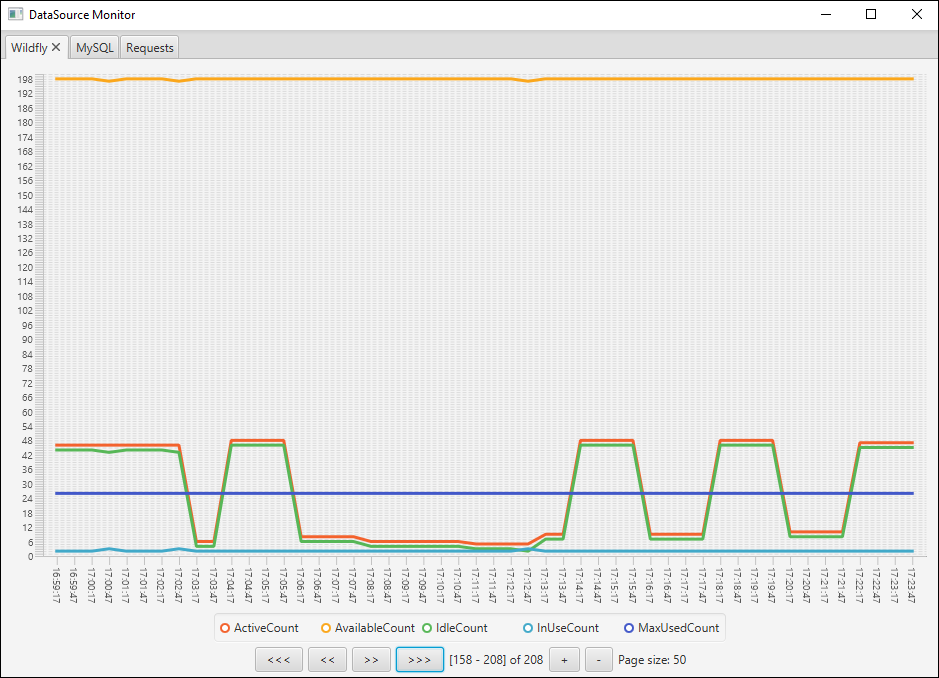

Universal Monitoring Tool
=========================

[То же самое на английском языке](README.md)

Утилита для мониторинга сетевых ресурсов, таких как базы данных, контейнеры сервлетов и различные URL.

* Гибкая настройка ресурсов и метрик в YAML-файле.
* Поддержка BASIC и DIGEST Authentication.
* UI на основе Java FX для просмотра статистики в виде линейных графиков.



Немного истории
---------------

Эта утилита была написана, когда у нас были проблемы с проектом в `Java EE` контейнере. 
Периодически вылетала ошибка `IJ000453: Unable to get managed connection for java:/d...`

Первая же мысль - не хватает соединений. Был смысл мониторить как базу данных, 
так и пул соединений в контейнере, параллельно обращаясь к ендпоинту проекта.

Поскольку девопс был далеко, сервера тоже, а пишем мы в Windows, то есть, установить что-то серьёзное, но бесплатное
для мониторинга не было возможности, было принято решение написать эту утилиту.

Очень надеюсь, что она пригодится ещё кому-то.

Установка и настройка
---------------------

* Скомпилировать проект: `mvn clean package`
* Скопировать файл `java-monitor.jar` из каталога `./target` в каталог `./example`.
* Настроить `config.yml`
* Запустить `launcher.bat`, или вручную: `java -jar java-monitor.jar`.

### Файл настроек

Все настройки собраны в файле `config.yml`. `YAML` позволяет удобно хранить любые данные в очень привлекательном виде.

#### Общие настройки

* `requestIntervalInSeconds`: интервал выполнения запросов в секундах.

#### Настройки интерфейса

* `ui.horizontalScale` и `ui.pageSize` регулируют плотность отображения данных по горизонтали. 
Можно оставить 1 и 200 соответственно.

* `charts`: настройка одного или нескольких линейных графиков.
  * `id`: идентификатор графика. К нему будут привязаны отдельные характеристики. Пример: `0`, `1`, `2`, ...
  * `name`: название панели, на которой будет отображаться график.
  * `lowerBound`: нижняя граница значений графика. Есть смысл оставить 0.
  * `upperBound`: верхняя граница значений графика. Настраивается под конкретные нужды. Например 200.
  * `tickCount`: частота горизонтальной "сетки" на графике.

#### Настройка задач

Метрики, полученные после каждого запроса можно очень гибко выводить в нужном графике, группируя их как угодно.

Сначала следует определиться с задачей - что именно будем мониторить.

Допустим, мы будем мониторить `DataSource WildFly`, базу данных `MySQL` и выполнять один запрос, 
чтобы удостовериться что проект ещё живой.

##### WildFly

```
tasks:
  # WildFly, DataSource
  - name: DataSource
    request: HTTP
    url: 'http://localhost:9990/management/subsystem/datasources/data-source/testDS/statistics/pool?read-resource&include-runtime=true&recursive&json.pretty'
    authentication:
      type: DIGEST
      userName: 'userName'
      password: 'password'
      params:
        host: localhost
        port: 9990
        realm: ManagementRealm
    responseFormat: JSON
    fields:
      - name: ActiveCount
        chartId: 0
        logAnyChange: false
      - name: BlockingFailureCount
        logAnyChange: true
```

Эта задача получает метрики от `WildFly`. Их очень много, внизу есть несколько ссылок на источники.
 
Значения поля `ActiveCount` будут видны на `графике-0`, а значения поля `BlockingFailureCount` - нет. 
Зато при любом изменении в консоли будет отображаться сообщение. Это очень удобно, когда есть несколько мало изменяемых данных,
и нет желания загромождать графики.

* `name`: название задачи. Отображается в логах консоли, так же служит именем файла для сохранения метрик.
* `request`: `HTTP`. Тут всё понятно. Другое возможное значение: `JDBC`.
* `authentication.type`: тип аутентификации. `NONE`, `BASIC`, `DIGEST`, `PASSWORD`. `BASIC` в целом то же самое, что и `PASSWORD`, 
но принудительно устанавливается заголовок `Authentication` (баг http-клиента).
* `responseFormat`: `JSON`. Устанавливается, когда мы знаем, что сервер возвращает метрики в `Json` формате. 
Далее они трансформируются в `Map` и фильтруются. 
Другие возможные значения: `CUSTOM` (неизвестный формат, это для базы данных), `STATUS_CODE_ONLY` - тело ответа игнорируется, 
возвращается только код результата выполнения (например, `200`, `401`, или `500`).

Поскольку `WildFly` просто так метрики не раздаёт, необходимо аутентифицироваться как `Management User`. 
Конкретно нужна `Digest Authentication`.

##### MySQL

Здесь всё просто, надо лишь добавить, что метрики получаются следующим запросом: `SHOW GLOBAL STATUS LIKE '%%'`.

```
  # MySQL address
  - name: MySql
    request: JDBC
    url: 'jdbc:mysql://localhost:3306/mydb?useUnicode=true&useJDBCCompliantTimezoneShift=true&useLegacyDatetimeCode=false&serverTimezone=UTC'
    authentication:
      type: PASSWORD
      userName: 'userName'
      password: 'password'
    responseFormat: CUSTOM
    fields:
      - name: Aborted_clients
        chartId: 1
        logAnyChange: false
      - name: Max_execution_time_set_failed
        logAnyChange: true
```

Естественно, что адрес базы данных, а так же имя пользователя и пароль будут другими.

##### Другой запрос

В этом примере мы просто будем проверять, что ендпоинт не падает и отрабатыват как нужно (код `200`).
Ендпоинт защищён при помощи `Basic Authentication`, но это не проблема.

Линия жизни сервера будет отображаться на `графике-2`.

В случае любого падения сообщения так же будут выведены в консоль.

```
  # Business request
  - name: Request
    request: HTTP
    url: 'http://translate.google.com/?hl=ru#view=home&op=translate&sl=en&tl=ru&text=This%20is%20an%20example'
    authentication:
      type: BASIC
      userName: 'userName'
      password: 'password'
    responseFormat: STATUS_CODE_ONLY
    fields:
      - name: StatusCode
        chartId: 2
        logAnyChange: true
```

Использование
-------------

Утилита периодически сохраняет метрики через заданный интервал времени. 
Так же сохранение происходит при выходе.

UI интуитивно понятен и позволяет гибко масштабировать данные, группируя их на нескольких панелях.

Отладка
-------

Если планируется дорабатывать утилиту, то для удобства работы в IDE файл `config.yml` можно скопировать в корень проекта.

Внешний вид графиков, например, цвет и толщина линий, цвет фона, и так далее, можно настраивать в файле `modena.css`. 
Потом надо будет его подключить: `pane.getStylesheets().add("modena.css");`. 
[Почитать про стили JavaFX](https://docs.oracle.com/javase/8/javafx/api/javafx/scene/doc-files/cssref.html).

Используемые технологии
-----------------------

* Java 8
* JavaFX 8
* YAML 1.1 (SnakeYAML)
* JSON (Jackson)
* MySQL через JDBC
* Apache HttpClient, Apache Commons
* Maven
* IntelliJ Idea

Wishlist
--------

* Save interval in config
* Dynamic height
* Manual height
* Height settings in config

Где можно найти информацию о метриках
-------------------------------------

### WildFly / JBoss

* http://middlewaremagic.com/jboss/?p=2476
* https://access.redhat.com/documentation/en-us/jboss_enterprise_application_platform/6.3/html/administration_and_configuration_guide/view_datasource_statistics
* https://docs.jboss.org/author/display/AS71/CLI+Recipes
* https://docs.wildfly.org/17/Admin_Guide.html

Пример DataSource метрик:

```json
{
"ActiveCount" : 6,
"AvailableCount" : 200,
"AverageBlockingTime" : 1,
"AverageCreationTime" : 4,
"AverageGetTime" : 3,
"AveragePoolTime" : 19440,
"AverageUsageTime" : 41,
"BlockingFailureCount" : 0,
"CreatedCount" : 7593,
"DestroyedCount" : 7587,
"IdleCount" : 6,
"InUseCount" : 0,
"MaxCreationTime" : 2016,
"MaxGetTime" : 2016,
"MaxPoolTime" : 4784742,
"MaxUsageTime" : 326639,
"MaxUsedCount" : 17,
"MaxWaitCount" : 0,
"MaxWaitTime" : 1,
"TimedOut" : 7587,
"TotalBlockingTime" : 340,
"TotalCreationTime" : 31219,
"TotalGetTime" : 8267,
"TotalPoolTime" : 2497681396,
"TotalUsageTime" : 35375564,
"WaitCount" : 0,
"XACommitAverageTime" : 0,
"XACommitCount" : 805251,
"XACommitMaxTime" : 297,
"XACommitTotalTime" : 695736,
"XAEndAverageTime" : 0,
"XAEndCount" : 0,
"XAEndMaxTime" : 0,
"XAEndTotalTime" : 0,
"XAForgetAverageTime" : 0,
"XAForgetCount" : 0,
"XAForgetMaxTime" : 0,
"XAForgetTotalTime" : 0,
"XAPrepareAverageTime" : 0,
"XAPrepareCount" : 0,
"XAPrepareMaxTime" : 0,
"XAPrepareTotalTime" : 0,
"XARecoverAverageTime" : 0,
"XARecoverCount" : 0,
"XARecoverMaxTime" : 0,
"XARecoverTotalTime" : 0,
"XARollbackAverageTime" : 0,
"XARollbackCount" : 2,
"XARollbackMaxTime" : 0,
"XARollbackTotalTime" : 0,
"XAStartAverageTime" : 0,
"XAStartCount" : 805253,
"XAStartMaxTime" : 9,
"XAStartTotalTime" : 9654,
"statistics-enabled" : true
}
```

### MySQL

* https://www.datadoghq.com/blog/collecting-mysql-statistics-and-metrics/
* https://dzone.com/articles/top-performance-metrics-to-monitor-in-your-mysql-d-1
* https://dzone.com/articles/top-performance-metrics-to-monitor-on-mysql-connec

Пример данных от MySQL:

```
Aborted_clients	129
Aborted_connects	10
Binlog_cache_disk_use	0
Binlog_cache_use	0
Binlog_stmt_cache_disk_use	0
Binlog_stmt_cache_use	0
Bytes_received	1141
Bytes_sent	32355
Com_admin_commands	1
Com_assign_to_keycache	0
Com_alter_db	0
Com_alter_db_upgrade	0
Com_alter_event	0
Com_alter_function	0
Com_alter_instance	0
Com_alter_procedure	0
Com_alter_server	0
Com_alter_table	0
Com_alter_tablespace	0
Com_alter_user	0
Com_analyze	0
Com_begin	0
Com_binlog	0
Com_call_procedure	0
Com_change_db	0
Com_change_master	0
Com_change_repl_filter	0
Com_check	0
Com_checksum	0
Com_commit	0
Com_create_db	0
Com_create_event	0
Com_create_function	0
Com_create_index	0
Com_create_procedure	0
Com_create_server	0
Com_create_table	0
Com_create_trigger	0
Com_create_udf	0
Com_create_user	0
Com_create_view	0
Com_dealloc_sql	0
Com_delete	0
Com_delete_multi	0
Com_do	0
Com_drop_db	0
Com_drop_event	0
Com_drop_function	0
Com_drop_index	0
Com_drop_procedure	0
Com_drop_server	0
Com_drop_table	0
Com_drop_trigger	0
Com_drop_user	0
Com_drop_view	0
Com_empty_query	0
Com_execute_sql	0
Com_explain_other	0
Com_flush	0
Com_get_diagnostics	0
Com_grant	0
Com_ha_close	0
Com_ha_open	0
Com_ha_read	0
Com_help	0
Com_insert	0
Com_insert_select	0
Com_install_plugin	0
Com_kill	0
Com_load	0
Com_lock_tables	0
Com_optimize	0
Com_preload_keys	0
Com_prepare_sql	0
Com_purge	0
Com_purge_before_date	0
Com_release_savepoint	0
Com_rename_table	0
Com_rename_user	0
Com_repair	0
Com_replace	0
Com_replace_select	0
Com_reset	0
Com_resignal	0
Com_revoke	0
Com_revoke_all	0
Com_rollback	0
Com_rollback_to_savepoint	0
Com_savepoint	0
Com_select	3
Com_set_option	7
Com_signal	0
Com_show_binlog_events	0
Com_show_binlogs	0
Com_show_charsets	2
Com_show_collations	1
Com_show_create_db	0
Com_show_create_event	0
Com_show_create_func	0
Com_show_create_proc	0
Com_show_create_table	0
Com_show_create_trigger	0
Com_show_databases	0
Com_show_engine_logs	0
Com_show_engine_mutex	0
Com_show_engine_status	0
Com_show_events	0
Com_show_errors	0
Com_show_fields	0
Com_show_function_code	0
Com_show_function_status	0
Com_show_grants	0
Com_show_keys	0
Com_show_master_status	0
Com_show_open_tables	0
Com_show_plugins	0
Com_show_privileges	0
Com_show_procedure_code	0
Com_show_procedure_status	0
Com_show_processlist	0
Com_show_profile	0
Com_show_profiles	0
Com_show_relaylog_events	0
Com_show_slave_hosts	0
Com_show_slave_status	0
Com_show_status	2
Com_show_storage_engines	1
Com_show_table_status	0
Com_show_tables	0
Com_show_triggers	0
Com_show_variables	10
Com_show_warnings	0
Com_show_create_user	0
Com_shutdown	0
Com_slave_start	0
Com_slave_stop	0
Com_group_replication_start	0
Com_group_replication_stop	0
Com_stmt_execute	0
Com_stmt_close	0
Com_stmt_fetch	0
Com_stmt_prepare	0
Com_stmt_reset	0
Com_stmt_send_long_data	0
Com_truncate	0
Com_uninstall_plugin	0
Com_unlock_tables	0
Com_update	0
Com_update_multi	0
Com_xa_commit	0
Com_xa_end	0
Com_xa_prepare	0
Com_xa_recover	0
Com_xa_rollback	0
Com_xa_start	0
Com_stmt_reprepare	0
Compression	OFF
Connection_errors_accept	0
Connection_errors_internal	0
Connection_errors_max_connections	0
Connection_errors_peer_address	0
Connection_errors_select	0
Connection_errors_tcpwrap	0
Connections	599795
Created_tmp_disk_tables	0
Created_tmp_files	41137
Created_tmp_tables	14
Delayed_errors	0
Delayed_insert_threads	0
Delayed_writes	0
Flush_commands	1
Handler_commit	0
Handler_delete	0
Handler_discover	0
Handler_external_lock	20
Handler_mrr_init	0
Handler_prepare	0
Handler_read_first	0
Handler_read_key	0
Handler_read_last	0
Handler_read_next	0
Handler_read_prev	0
Handler_read_rnd	0
Handler_read_rnd_next	10437
Handler_rollback	0
Handler_savepoint	0
Handler_savepoint_rollback	0
Handler_update	0
Handler_write	5363
Innodb_buffer_pool_dump_status	Dumping of buffer pool not started
Innodb_buffer_pool_load_status	Buffer pool(s) load completed at 190712 13:40:37
Innodb_buffer_pool_resize_status	
Innodb_buffer_pool_pages_data	862925
Innodb_buffer_pool_bytes_data	14138163200
Innodb_buffer_pool_pages_dirty	3
Innodb_buffer_pool_bytes_dirty	49152
Innodb_buffer_pool_pages_flushed	20365739
Innodb_buffer_pool_pages_free	401512
Innodb_buffer_pool_pages_misc	46123
Innodb_buffer_pool_pages_total	1310560
Innodb_buffer_pool_read_ahead_rnd	0
Innodb_buffer_pool_read_ahead	89613
Innodb_buffer_pool_read_ahead_evicted	0
Innodb_buffer_pool_read_requests	34332475117
Innodb_buffer_pool_reads	363306
Innodb_buffer_pool_wait_free	0
Innodb_buffer_pool_write_requests	2400669886
Innodb_data_fsyncs	33293193
Innodb_data_pending_fsyncs	0
Innodb_data_pending_reads	0
Innodb_data_pending_writes	0
Innodb_data_read	7460524544
Innodb_data_reads	455951
Innodb_data_writes	50550006
Innodb_data_written	658111357952
Innodb_dblwr_pages_written	14884591
Innodb_dblwr_writes	2429421
Innodb_log_waits	0
Innodb_log_write_requests	102897619
Innodb_log_writes	26952074
Innodb_os_log_fsyncs	27752728
Innodb_os_log_pending_fsyncs	0
Innodb_os_log_pending_writes	0
Innodb_os_log_written	80247788544
Innodb_page_size	16384
Innodb_pages_created	407576
Innodb_pages_read	455349
Innodb_pages_written	20365739
Innodb_row_lock_current_waits	10
Innodb_row_lock_time	5282308
Innodb_row_lock_time_avg	1
Innodb_row_lock_time_max	29352
Innodb_row_lock_waits	3180759
Innodb_rows_deleted	10278902
Innodb_rows_inserted	1056706304
Innodb_rows_read	20311769645
Innodb_rows_updated	70017970
Innodb_num_open_files	606
Innodb_truncated_status_writes	0
Innodb_available_undo_logs	128
Key_blocks_not_flushed	0
Key_blocks_unused	6694
Key_blocks_used	11
Key_read_requests	11874
Key_reads	176
Key_write_requests	0
Key_writes	0
Last_query_cost	0.000000
Last_query_partial_plans	2
Locked_connects	0
Max_execution_time_exceeded	0
Max_execution_time_set	0
Max_execution_time_set_failed	0
Max_used_connections	210
Max_used_connections_time	2019-07-25 14:17:30
Not_flushed_delayed_rows	0
Ongoing_anonymous_transaction_count	0
Open_files	2
Open_streams	0
Open_table_definitions	1147
Open_tables	1488
Opened_files	197388
Opened_table_definitions	0
Opened_tables	1
Performance_schema_accounts_lost	0
Performance_schema_cond_classes_lost	0
Performance_schema_cond_instances_lost	0
Performance_schema_digest_lost	0
Performance_schema_file_classes_lost	0
Performance_schema_file_handles_lost	0
Performance_schema_file_instances_lost	0
Performance_schema_hosts_lost	0
Performance_schema_index_stat_lost	0
Performance_schema_locker_lost	0
Performance_schema_memory_classes_lost	0
Performance_schema_metadata_lock_lost	0
Performance_schema_mutex_classes_lost	0
Performance_schema_mutex_instances_lost	0
Performance_schema_nested_statement_lost	0
Performance_schema_prepared_statements_lost	0
Performance_schema_program_lost	0
Performance_schema_rwlock_classes_lost	0
Performance_schema_rwlock_instances_lost	0
Performance_schema_session_connect_attrs_lost	0
Performance_schema_socket_classes_lost	0
Performance_schema_socket_instances_lost	0
Performance_schema_stage_classes_lost	0
Performance_schema_statement_classes_lost	0
Performance_schema_table_handles_lost	0
Performance_schema_table_instances_lost	0
Performance_schema_table_lock_stat_lost	0
Performance_schema_thread_classes_lost	0
Performance_schema_thread_instances_lost	0
Performance_schema_users_lost	0
Prepared_stmt_count	0
Qcache_free_blocks	0
Qcache_free_memory	0
Qcache_hits	0
Qcache_inserts	0
Qcache_lowmem_prunes	0
Qcache_not_cached	0
Qcache_queries_in_cache	0
Qcache_total_blocks	0
Queries	1136385057
Questions	26
Select_full_join	0
Select_full_range_join	0
Select_range	0
Select_range_check	0
Select_scan	24
Slave_open_temp_tables	0
Slow_launch_threads	0
Slow_queries	0
Sort_merge_passes	0
Sort_range	0
Sort_rows	0
Sort_scan	0
Ssl_accept_renegotiates	0
Ssl_accepts	0
Ssl_callback_cache_hits	0
Ssl_cipher	
Ssl_cipher_list	
Ssl_client_connects	0
Ssl_connect_renegotiates	0
Ssl_ctx_verify_depth	0
Ssl_ctx_verify_mode	0
Ssl_default_timeout	0
Ssl_finished_accepts	0
Ssl_finished_connects	0
Ssl_server_not_after	
Ssl_server_not_before	
Ssl_session_cache_hits	0
Ssl_session_cache_misses	0
Ssl_session_cache_mode	NONE
Ssl_session_cache_overflows	0
Ssl_session_cache_size	0
Ssl_session_cache_timeouts	0
Ssl_sessions_reused	0
Ssl_used_session_cache_entries	0
Ssl_verify_depth	0
Ssl_verify_mode	0
Ssl_version	
Table_locks_immediate	21813
Table_locks_waited	0
Table_open_cache_hits	9
Table_open_cache_misses	1
Table_open_cache_overflows	1
Tc_log_max_pages_used	0
Tc_log_page_size	0
Tc_log_page_waits	0
Threads_cached	22
Threads_connected	11
Threads_created	193426
Threads_running	1
Uptime	2950306
Uptime_since_flush_status	2950306
```
